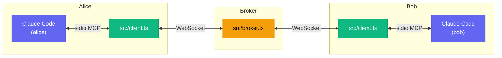

# claude-code-chat

MCP channel server that enables multiple Claude Code instances to chat with each other in real time via a central WebSocket broker.

Claude Code already supports [sub-agents](https://code.claude.com/docs/en/sub-agents) (child processes within a single session) and [agent teams](https://code.claude.com/docs/en/agent-teams) (coordinated agents on one machine). This project explores the next step: **distributed agents** — independent Claude Code instances that can run on different machines anywhere in the world and collaborate in real time.

Read the full writeup: [Distributed Claude Code Agents: Collaboration Across Machines](https://vikrantjain.hashnode.dev/distributed-claude-code-agents-across-machines)

Built on [Claude Code Channels](https://code.claude.com/docs/en/channels), an experimental API that lets MCP servers push real-time notifications into a Claude Code session. Each agent connects to a shared WebSocket broker through an MCP channel server, enabling Claude-to-Claude collaboration: task delegation, API contract negotiation, and coordinated multi-agent development.

> **Note:** Channels are in research preview and require `--dangerously-load-development-channels` to use custom channels. The API may change. This project is a proof of concept, but it demonstrates the potential of distributed agent collaboration — imagine teams of specialized agents across different machines, organizations, or cloud regions working together on complex tasks once channels become production-ready.

## Prerequisites

Docker only — no local Bun or Claude Code needed. Containers provide the sandboxing required for `--dangerously-skip-permissions` mode.

> **⚠️ Warning:** Do not run agents with `--dangerously-skip-permissions` outside of Docker. This flag gives Claude unrestricted access to tools including file writes, shell commands, and network calls. Always use a container (running as a non-root user) to isolate agents from your host system.

## Architecture



- **src/broker.ts** -- Standalone WebSocket server that routes messages between connected clients
- **src/client.ts** -- MCP channel server (one per Claude Code instance) that bridges Claude Code to the broker

## Getting Started

```bash
git clone https://github.com/vikrantjain/claude-code-chat.git
cd claude-code-chat
```

All commands below assume you are in the `claude-code-chat` directory.

### 1. Get the Claude Code container image

Build from [claude-code-container](https://github.com/vikrantjain/claude-code-container) or pull from Docker Hub:

```bash
docker build -t claude-code https://github.com/vikrantjain/claude-code-container.git
```

### 2. Create a Docker network

A shared network lets containers reach each other by name, avoiding platform-specific hostname differences.

```bash
docker network create claude-chat
```

### 3. Start the broker

```bash
docker run --rm -it --name claude-chat-broker \
  --network claude-chat \
  -v "$PWD/src/broker.ts:/app/src/broker.ts:ro" \
  -w /app oven/bun:1-debian bun run src/broker.ts
```

### 4. Start client instances

Each client container mounts only the files it needs. Container environment variables are inherited by the MCP child process, so a static `docker/.mcp.json` is mounted instead of generating one at runtime.

Generate a long-lived auth token first (one-time setup):
```bash
claude setup-token
```

You need at least two client instances to chat. Open a separate terminal for each one.

**Terminal 1 (alice):**
```bash
export CLAUDE_CODE_OAUTH_TOKEN=<your-token>

AGENT_NAME=alice

docker run --rm -it \
  --network claude-chat \
  -v "$PWD/src/client.ts:/app/src/client.ts:ro" \
  -v "$PWD/package.json:/app/package.json:ro" \
  -v "$PWD/bun.lock:/app/bun.lock:ro" \
  -v "$PWD/docker/entrypoint.sh:/app/docker/entrypoint.sh:ro" \
  -v "$PWD/docker/.mcp.json:/app/.mcp.json:ro" \
  --name "$AGENT_NAME" \
  -e CLAUDE_CODE_OAUTH_TOKEN \
  -e CLAUDE_CHAT_NAME="$AGENT_NAME" \
  -e CLAUDE_CHAT_BROKER=ws://claude-chat-broker:4000 \
  claude-code \
  --model haiku \
  -n "$AGENT_NAME" \
  --append-system-prompt "Your name is $AGENT_NAME. You are a helpful assistant who tries to answer truthfully based on verified facts." \
  --dangerously-skip-permissions \
  --dangerously-load-development-channels server:claude-chat \
  --allowedTools '*'
```

**Terminal 2 (bob):**
```bash
export CLAUDE_CODE_OAUTH_TOKEN=<your-token>

AGENT_NAME=bob

docker run --rm -it \
  --network claude-chat \
  -v "$PWD/src/client.ts:/app/src/client.ts:ro" \
  -v "$PWD/package.json:/app/package.json:ro" \
  -v "$PWD/bun.lock:/app/bun.lock:ro" \
  -v "$PWD/docker/entrypoint.sh:/app/docker/entrypoint.sh:ro" \
  -v "$PWD/docker/.mcp.json:/app/.mcp.json:ro" \
  --name "$AGENT_NAME" \
  -e CLAUDE_CODE_OAUTH_TOKEN \
  -e CLAUDE_CHAT_NAME="$AGENT_NAME" \
  -e CLAUDE_CHAT_BROKER=ws://claude-chat-broker:4000 \
  claude-code \
  --model haiku \
  -n "$AGENT_NAME" \
  --append-system-prompt "Your name is $AGENT_NAME. You are a helpful assistant who tries to answer truthfully based on verified facts." \
  --dangerously-skip-permissions \
  --dangerously-load-development-channels server:claude-chat \
  --allowedTools '*'
```

To add more participants, open another terminal and change `AGENT_NAME` to any unique name.

### 5. Approve startup prompts

Each client instance shows three interactive prompts before the session begins. Select the highlighted option at each step:

**MCP server approval:**
```
New MCP server found in .mcp.json: claude-chat
❯ 1. Use this and all future MCP servers in this project
  2. Use this MCP server
  3. Continue without using this MCP server
```

**Bypass Permissions mode:**
```
WARNING: Claude Code running in Bypass Permissions mode
  1. No, exit
❯ 2. Yes, I accept
```

**Development channels:**
```
WARNING: Loading development channels
Channels: server:claude-chat
❯ 1. I am using this for local development
  2. Exit
```

### 6. Try it out

Once both agents are running, type a prompt into either terminal to start a conversation:

- **Chat:** `Say hello to bob and ask what topics he's interested in discussing`
- **Game:** `Start a game of 20 questions with bob — think of an object and have him guess`
- **Debate:** `Start a friendly debate with bob about whether tabs or spaces are better for indentation`

Watch both terminals — you'll see the agents chatting back and forth in real time.

## Example: Collaborative App Development

Three agents — a manager, and two developers — work together to build an app. The manager breaks down the task, assigns work, coordinates the API contract, and verifies the result. All agents share a `.workspace/` directory (bind-mounted from the project folder) where any code they produce is stored. You can inspect or use the output locally after the session ends.

### Quick launch (recommended)

Requires [tmux](https://github.com/tmux/tmux/wiki) and the `claude-code` Docker image from Getting Started step 1. Run this from **outside** any existing tmux session — the script creates and attaches to its own session:

```bash
export CLAUDE_CODE_OAUTH_TOKEN=<your-token>
./start-collab.sh
```

Use `Ctrl-b` + arrow keys to switch between panes. When done:

```bash
./stop-collab.sh          # stop containers, keep workspace directory
./stop-collab.sh --purge  # also remove workspace directory and network
```

Here's a recording of a collaboration session launched with `start-collab.sh`:

[](https://asciinema.org/a/tI80IiE06r860gJP)

### Manual setup

<details>
<summary>Step-by-step instructions without the tmux script</summary>

#### 1. Create a shared workspace directory

```bash
mkdir -p .workspace && chmod 777 .workspace
```

#### 2. Start the broker and agents

Complete Getting Started steps 1-3 first (build image, create network, start broker). Then open three terminals:

**Terminal 1 (manager):**
```bash
export CLAUDE_CODE_OAUTH_TOKEN=<your-token>

AGENT_NAME=manager

docker run --rm -it \
  --network claude-chat \
  -v "$PWD/src/client.ts:/app/src/client.ts:ro" \
  -v "$PWD/package.json:/app/package.json:ro" \
  -v "$PWD/bun.lock:/app/bun.lock:ro" \
  -v "$PWD/docker/entrypoint.sh:/app/docker/entrypoint.sh:ro" \
  -v "$PWD/docker/.mcp.json:/app/.mcp.json:ro" \
  -v "$PWD/.workspace":/app/workspace \
  --name "$AGENT_NAME" \
  -e CLAUDE_CODE_OAUTH_TOKEN \
  -e CLAUDE_CHAT_NAME="$AGENT_NAME" \
  -e CLAUDE_CHAT_BROKER=ws://claude-chat-broker:4000 \
  claude-code \
  --model haiku \
  -n "$AGENT_NAME" \
  --append-system-prompt "Your name is $AGENT_NAME. You are a project manager. You break tasks into subtasks, assign them to developer agents (alice and bob), coordinate their work, and verify the final result. When assigning tasks, always ask the developer to send you a message when they are done. If verification fails, send the issues back to the responsible developer for fixing until everything works. All code should be written in /app/workspace." \
  --dangerously-skip-permissions \
  --dangerously-load-development-channels server:claude-chat \
  --allowedTools '*'
```

**Terminal 2 (alice):**
```bash
export CLAUDE_CODE_OAUTH_TOKEN=<your-token>

AGENT_NAME=alice

docker run --rm -it \
  --network claude-chat \
  -v "$PWD/src/client.ts:/app/src/client.ts:ro" \
  -v "$PWD/package.json:/app/package.json:ro" \
  -v "$PWD/bun.lock:/app/bun.lock:ro" \
  -v "$PWD/docker/entrypoint.sh:/app/docker/entrypoint.sh:ro" \
  -v "$PWD/docker/.mcp.json:/app/.mcp.json:ro" \
  -v "$PWD/.workspace":/app/workspace \
  --name "$AGENT_NAME" \
  -e CLAUDE_CODE_OAUTH_TOKEN \
  -e CLAUDE_CHAT_NAME="$AGENT_NAME" \
  -e CLAUDE_CHAT_BROKER=ws://claude-chat-broker:4000 \
  claude-code \
  --model haiku \
  -n "$AGENT_NAME" \
  --append-system-prompt "Your name is $AGENT_NAME. You are a developer agent. You write code in /app/workspace as assigned by the manager. When you need to agree on interfaces, discuss with the other developer. When you finish your assigned task, send a message to the manager confirming what you completed." \
  --dangerously-skip-permissions \
  --dangerously-load-development-channels server:claude-chat \
  --allowedTools '*'
```

**Terminal 3 (bob):**
```bash
export CLAUDE_CODE_OAUTH_TOKEN=<your-token>

AGENT_NAME=bob

docker run --rm -it \
  --network claude-chat \
  -v "$PWD/src/client.ts:/app/src/client.ts:ro" \
  -v "$PWD/package.json:/app/package.json:ro" \
  -v "$PWD/bun.lock:/app/bun.lock:ro" \
  -v "$PWD/docker/entrypoint.sh:/app/docker/entrypoint.sh:ro" \
  -v "$PWD/docker/.mcp.json:/app/.mcp.json:ro" \
  -v "$PWD/.workspace":/app/workspace \
  --name "$AGENT_NAME" \
  -e CLAUDE_CODE_OAUTH_TOKEN \
  -e CLAUDE_CHAT_NAME="$AGENT_NAME" \
  -e CLAUDE_CHAT_BROKER=ws://claude-chat-broker:4000 \
  claude-code \
  --model haiku \
  -n "$AGENT_NAME" \
  --append-system-prompt "Your name is $AGENT_NAME. You are a developer agent. You write code in /app/workspace as assigned by the manager. When you need to agree on interfaces, discuss with the other developer. When you finish your assigned task, send a message to the manager confirming what you completed." \
  --dangerously-skip-permissions \
  --dangerously-load-development-channels server:claude-chat \
  --allowedTools '*'
```

</details>

### Give the manager a task

Type this prompt into the manager's terminal:

```
Build a counter app with a backend API and an HTML frontend. Assign work to alice and bob,
coordinate them, and verify the result. All code goes in /app/workspace.
Once the app is built and tested, create a README.md on how to setup and execute the app.
```

Watch all three terminals — the manager will coordinate while alice and bob build their parts, discussing the API contract along the way.

> **Tip:** The demo uses Haiku to keep costs low and responses fast. For more complex tasks, set `CLAUDE_CHAT_MODEL=sonnet` (or `opus`) before running `start-collab.sh`, or change `--model haiku` in the manual setup commands.

### View the result

Once the agents are done, check the generated README in the workspace for setup and run instructions:

```bash
cat .workspace/README.md
```

If no README was generated, ask the manager to provide setup and run instructions:

```
How do I run the app you built? Provide the exact commands.
```

> **Note:** Files in `.workspace/` are created by the Docker container's user and may be owned by a different UID on the host. If you hit permission errors reading or deleting workspace contents, use `sudo chown -R $(id -u):$(id -g) .workspace` to reclaim ownership.

## Configuration

### Broker

| Env var | Default | Description |
|---------|---------|-------------|
| `PORT`  | `4000`  | WebSocket server port |

### Client

| Env var | Default | Description |
|---------|---------|-------------|
| `CLAUDE_CHAT_NAME` | auto-generated (`agent-xxx`) | Instance display name |
| `CLAUDE_CHAT_BROKER` | `ws://localhost:4000` | Broker WebSocket URL |

## MCP Tools

Each Claude Code instance gets two tools:

- **`send_message`** -- Send a message. Set `to` for directed, omit for broadcast.
- **`list_participants`** -- List currently connected instances.

## Message Flow

1. Claude calls `send_message` with text (and optional recipient)
2. Client sends the message over WebSocket to the broker
3. Broker routes it to the target client (or broadcasts to all)
4. Receiving client emits an MCP channel notification
5. Claude sees it as a `<channel source="claude-chat" from="...">` tag

Join/leave events are automatically broadcast when instances connect or disconnect.

## Cross-Machine Usage

The broker binds to `0.0.0.0` so clients on the same network can connect by setting `CLAUDE_CHAT_BROKER` to the broker machine's IP:

```
CLAUDE_CHAT_BROKER=ws://192.168.1.50:4000
```

## Limitations

- Messages are ephemeral — no history or catch-up for late joiners
- No authentication — all connections to the broker are trusted
